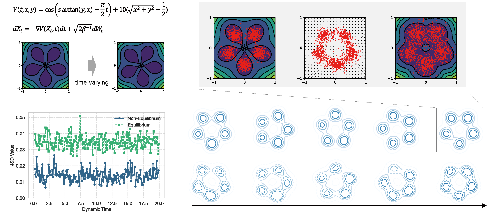

# Beyond Equilibrium: Non‑Equilibrium Foundations Should Underpin Generative Processes in Complex Dynamical Systems

Thank you for reviewing our manuscript: 📄 *"Beyond Equilibrium: Non‑Equilibrium Foundations Should Underpin Generative Processes in Complex Dynamical Systems"*

This repository contains the implementation of **the experiment in Section 3**.



&nbsp;

## Demo

> This code relies only on some libraries, including `torch`, `sdeint`, `tqdm`, and `diffusers`.

### Steps to Run

1️⃣ Data Preprocess

```shell
python simulate.py
```

2️⃣ Train & Test Non-equilirium Method

```shell
python diffuser.py # train
python generate.py # test
```

3️⃣ Train & Test Equilirium Method

```shell
python ebm.py # train & test
```

